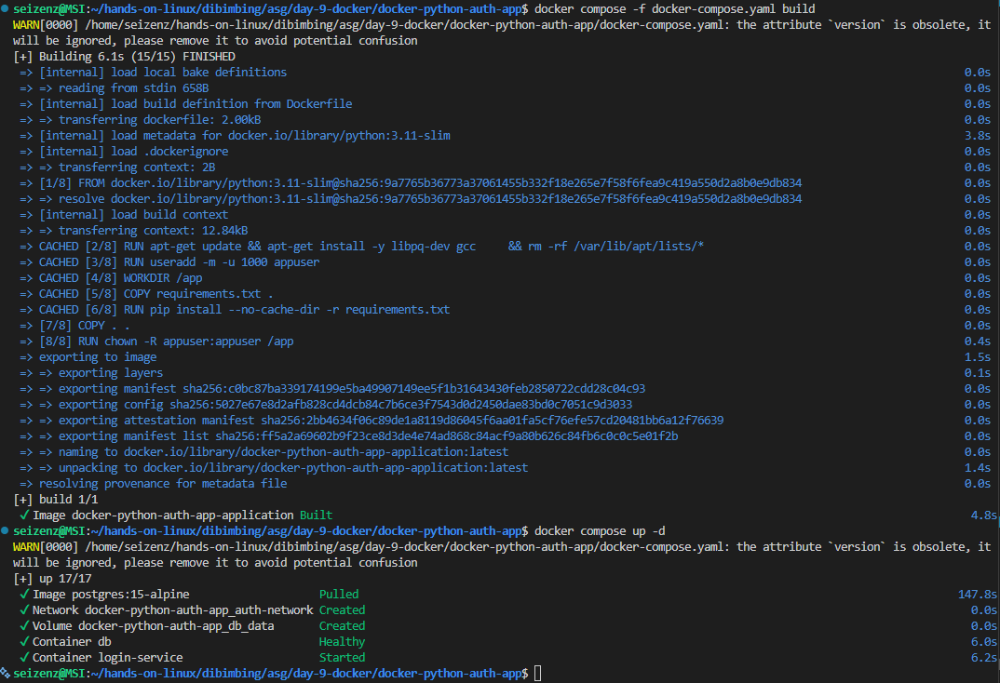
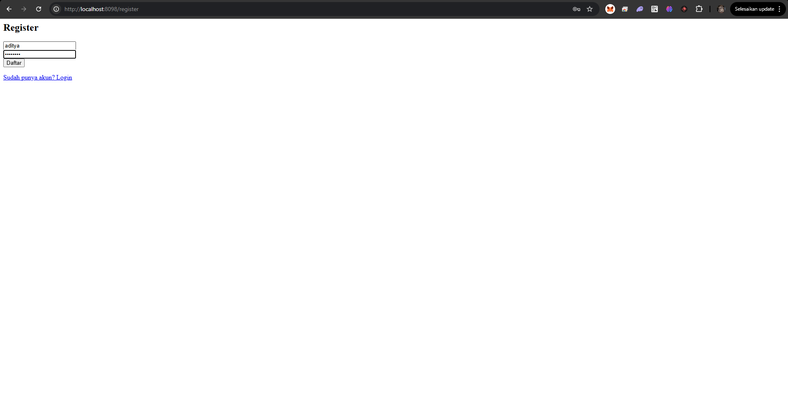
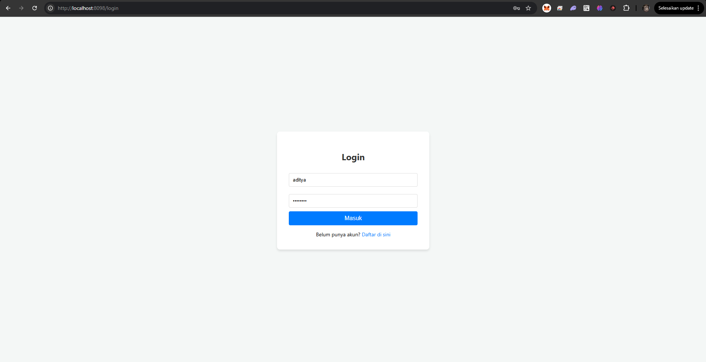
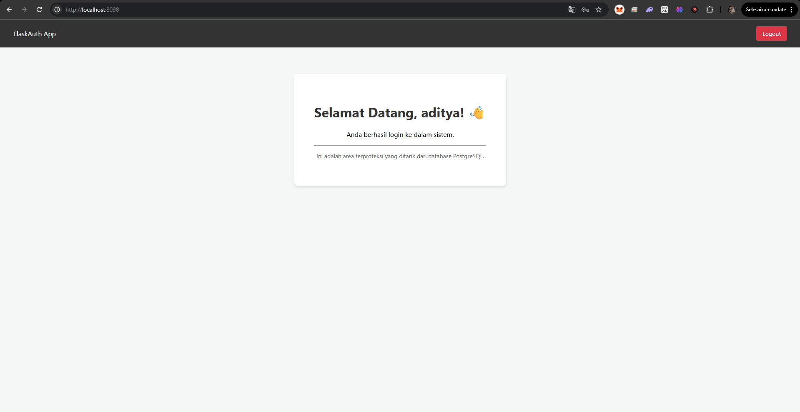

# 🛡️ Secure Python Auth App with Docker & PostgreSQL


Komponen utama:
- app: service flask app.
- database: service PostgreSQL.

🌎 **Language:** [Bahasa Indonesia](#bahasa-indonesia) | [English](#english)

---

<a id="bahasa-indonesia"></a>
## Tentang Repository

Selamat datang di repositori **Secure Python Auth App**. Project ini mendemonstrasikan strategi kontainerisasi siap produksi (*production-ready*) untuk aplikasi autentikasi berbasis Python (Flask) yang terintegrasi dengan database PostgreSQL. Seluruh *environment* diorkestrasi sepenuhnya menggunakan **Docker Compose**, memastikan portabilitas tinggi, keamanan, serta konsistensi *deployment* di berbagai lingkungan (Development, Staging, Production).

### 📋 Daftar Isi
- [Fitur Utama & Praktik Terbaik](#fitur-utama--praktik-terbaik)
- [Prasyarat](#prasyarat)
- [Panduan Mulai Cepat](#panduan-mulai-cepat)
- [Tangkapan Layar](#tangkapan-layar)

### 🚀 Fitur Utama & Praktik Terbaik
Untuk mematuhi standar industri DevOps dan DevSecOps, project ini mengimplementasikan praktik-praktik berikut:
- **Keamanan Utama (Non-Root User)**: Dockerfile dikonfigurasi untuk menjalankan aplikasi menggunakan user *non-root* (`appuser`). Hal ini memitigasi risiko serangan ekskalasi hak istimewa (*privilege escalation*).
- **Ukuran Image Optimal**: Menggunakan `python:3.11-slim` sebagai *base image* dan memanfaatkan flag `--no-cache-dir` saat instalasi dependensi untuk menjaga ukuran *image* tetap ringan.
- **Resiliensi Layanan (Healthchecks)**: Menyelesaikan masalah umum *"race condition"* di mana aplikasi sering *crash* karena database belum siap. Fitur `healthcheck` (`pg_isready`) memastikan aplikasi Flask baru menyala **setelah** PostgreSQL sepenuhnya diinisialisasi dan siap menerima koneksi.
- **Persistensi Data**: Menerapkan Docker Volumes (`db_data`) untuk memastikan bahwa rekaman database (data *user*) tetap tersimpan aman meskipun kontainer di-*restart* atau dihancurkan.
- **Isolasi Jaringan**: Kedua layanan (*app* dan *db*) ditempatkan dalam *bridge network* kustom khusus (`auth-network`), memastikan komunikasi antar kontainer terisolasi dan aman.
- **Manajemen Rahasia (Secret Management)**: Kredensial database dipisahkan secara ketat dari *codebase* utama menggunakan konfigurasi file `.env`.

### 🛠 Prasyarat
- Docker (v20+)
- Docker Compose (v2+)
- Git

### ⚙️ Panduan Mulai Cepat

**1. Clone Repository**
```bash
git clone https://github.com/seizenz7/docker-python-auth-app.git
cd docker-python-auth-app
```
1. Buat file [Dockerfile](./Dockerfile)
2. Buat file [docker-compose.yaml](./docker-compose.yaml)
3. Buat file .env seperti pada contoh [.env-example](./.env-example)
4. Lakukan build docker images dengan menggunakan perintah `docker compose -f docker-compose.yaml build`
5. Jalankan service aplikasi dengan menggunakan perintah `docker compose up -d`

**2. Konfigurasi Environment**
Buat file `.env` di direktori utama. Anda dapat menggunakan `.env-example` yang disediakan sebagai template:
```bash
cp .env-example .env
```
Pastikan variabel cocok dengan kredensial database yang Anda inginkan:
```env
DB_NAME=auth_db
DB_USER=admin
DB_PASSWORD=secretpassword
DB_PORT=5432
```

**3. Build & Jalankan Kontainer**
Jalankan aplikasi dan database dalam mode *detached* (di latar belakang):
```bash
docker compose up -d --build
```

**4. Akses Aplikasi**
Setelah kedua kontainer berjalan (dan *healthcheck* database berstatus *pass*), akses aplikasi Flask di:
👉 **http://localhost:8098**

Untuk menghentikan layanan, jalankan:
```bash
docker compose down
```

### 📸 Tangkapan Layar
#### 1. Build and Run Process

#### 2. Register Page

#### 3. Login Page

#### 4. User Dashboard (Home)


---

<a id="english"></a>
## About Repository

Welcome to the **Secure Python Auth App** repository. This project demonstrates a production-ready containerization strategy for a Python (Flask) authentication application integrated with a PostgreSQL database. The environment is fully orchestrated using **Docker Compose**, ensuring high portability, security, and consistent deployments across different environments (Development, Staging, Production).

### 📋 Table of Contents
- [Key Features & Best Practices](#key-features--best-practices)
- [Prerequisites](#prerequisites)
- [Quick Start Guide](#quick-start-guide)
- [Screenshots](#screenshots)

### 🚀 Key Features & Best Practices
To adhere to DevOps and DevSecOps industry standards, this project implements the following practices:
- **Security First (Non-Root User)**: The Dockerfile is configured to run the application using a dedicated, non-root user (`appuser`). This mitigates the risk of privilege escalation attacks.
- **Optimized Image Size**: Uses `python:3.11-slim` as the base image and utilizes `--no-cache-dir` during dependency installation to maintain a lightweight footprint.
- **Service Resilience (Healthchecks)**: Addresses the common "race condition" issue where the app crashes because the database isn't ready. A `pg_isready` healthcheck ensures the Flask app only boots **after** PostgreSQL is fully initialized and accepting connections.
- **Data Persistence**: Employs Docker Volumes (`db_data`) to ensure that database records (user data) survive container restarts and tear-downs.
- **Network Isolation**: Both services are placed within a dedicated custom bridge network (`auth-network`), ensuring secure, isolated inter-container communication.
- **Secret Management**: Database credentials are strictly separated from the codebase using a `.env` file configuration.

### 🛠 Prerequisites
- Docker (v20+)
- Docker Compose (v2+)
- Git

### ⚙️ Quick Start Guide

**1. Clone the Repository**
```bash
git clone https://github.com/seizenz7/docker-python-auth-app.git
cd docker-python-auth-app
```

**2. Environment Configuration**
Create a `.env` file in the root directory. You can use the provided `.env-example` as a template:
```bash
cp .env-example .env
```
Ensure the variables match your desired database credentials:
```env
DB_NAME=auth_db
DB_USER=admin
DB_PASSWORD=secretpassword
DB_PORT=5432
```

**3. Build and Run the Containers**
Launch the application and database in detached mode:
```bash
docker compose up -d --build
```

**4. Access the Application**
Once both containers are running (and the database healthcheck passes), access the Flask application at:
👉 **http://localhost:8098**

To stop the services, run:
```bash
docker compose down
```

### 📸 Screenshots
#### 1. Build and Run Process

#### 2. Register Page

#### 3. Login Page

#### 4. User Dashboard (Home)

- Home

